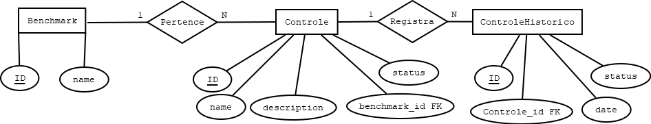
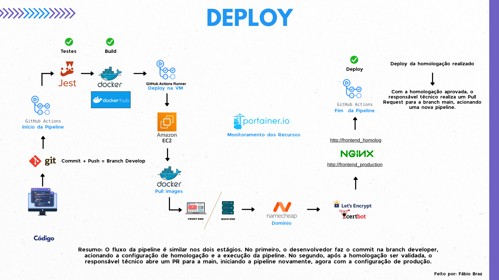

# 📊 Case Técnico

# 1ª Questão: Banco de Dados (conceitual + índices básicos)

## 📌 Mini-mundo

- **Benchmark** (`id`, `name`) tem vários **Controles**.  
- **Controle** (`id`, `name`, `description`) pertence a um Benchmark e possui um estado (`ok` | `alarm`).  
- Deve ser possível **registrar mudanças de estado** para reconstruir o histórico.

---

## 📐 Modelo Conceitual (MER)



### Entidades e Relacionamentos

| Entidade        | Atributos                                                                 |
|-----------------|---------------------------------------------------------------------------|
| **Benchmark**   | `id` (PK), `name`                                                         |
| **Controle**    | `id` (PK), `name`, `description`, `benchmark_id` (FK → Benchmark), `status`         |
| **ControleHistorico** | `id` (PK), `controle_id` (FK → Controle), `status` (`ok` \| `alarm`), `date` |

---

## 🔎 Cenários Atendidos (usando JOINs conceituais)

- **Q1: Listar Benchmark com seus Controles e o estado atual**  
  Fazer um JOIN entre **Benchmark** e **Controle** e utilizar a coluna **status** da tabela Controle para mostrar o estado mais recente de cada controle.

- **Q2: Listar Benchmark com seus Controles e as mudanças de estado em um intervalo**  
  Fazer um JOIN entre **Benchmark**, **Controle** e **ControleHistorico**, filtrando as linhas de **ControleHistorico** que estiverem dentro do intervalo de datas desejado.

- **Q3: Obter Benchmark com seus Controles e o estado em uma data/hora X**  
  Fazer um JOIN entre **Benchmark**, **Controle** e **ControleHistorico**, pegando para cada controle a última linha de **ControleHistorico** com **date <= X**.

## ⚡ Etapa de Índices

Para otimizar as consultas Q1, Q2 e Q3, foram definidos os seguintes índices:

### 1. Índice em `Controle(benchmark_id)`

```sql
CREATE INDEX idx_controle_benchmark_id ON Controle(benchmark_id);
```

- **Motivação:** acelera os JOINs entre `Benchmark` e `Controle`.  
- **Benefício:** evita varredura completa na tabela `Controle` ao buscar todos os controles de um benchmark.  
- **Atende:** cenário **Q1**.

---

### 2. Índice composto em `ControleHistorico(controle_id, date)`

```sql
CREATE INDEX idx_historico_controle_id_date ON ControleHistorico(controle_id, date);
```

- **Motivação:** consultas históricas filtram por `controle_id` e intervalo de `date`.  
- **Benefício:** permite localizar rapidamente eventos de um controle em uma faixa de tempo, além de ajudar em ordenações por data.  
- **Atende:** cenário **Q2**.

---

### 3. Índice composto decrescente em `ControleHistorico(controle_id, date DESC)`

```sql
CREATE INDEX idx_historico_controle_date_desc ON ControleHistorico(controle_id, date DESC);
```

- **Motivação:** recuperar o último estado de cada controle antes de uma data X.  
- **Benefício:** evita varredura completa do histórico, retornando de forma eficiente o registro mais recente (útil para `ORDER BY date DESC LIMIT 1`).  
- **Atende:** cenário **Q3**.

# 2ª Questão: Automação de Ambientes Operacionais

Este script em **Golang** automatiza a gestão de backups do servidor centralizado "Acme Co.", seguindo os requisitos do desafio:

- Listar todos os arquivos (nome, tamanho, data de criação, última modificação) localizados em `valcann/backupsFrom`
- Salvar o resultado no arquivo `backupsFrom.log` em `valcann/`
- Remover arquivos com data de criação superior a 3 dias
- Copiar arquivos com data de criação menor ou igual a 3 dias para `valcann/backupsTo`
- Salvar o resultado no arquivo `backupsTo.log` em `valcann/`

---

## Estrutura do Projeto

```bash
valcann/
├── backupsFrom/
├── backupsTo/
└── mock.json

```
## Mock de arquivos (valcann/mock.json)

```bash
[
  {
    "nome": "backup1.tar.gz",
    "tamanho_bytes": 52428800,
    "data_criacao": "2025-09-08T10:30:00Z",
    "ultima_modificacao": "2025-09-07T12:00:00Z"
  },
  {
    "nome": "backup2.tar.gz",
    "tamanho_bytes": 73400320,
    "data_criacao": "2025-09-06T15:10:00Z",
    "ultima_modificacao": "2025-09-06T15:20:00Z"
  },
  {
    "nome": "backup3.tar.gz",
    "tamanho_bytes": 104857600,
    "data_criacao": "2025-09-03T08:45:00Z",
    "ultima_modificacao": "2025-09-03T09:00:00Z"
  },
  {
    "nome": "backup4.tar.gz",
    "tamanho_bytes": 15728640,
    "data_criacao": "2025-09-01T20:00:00Z",
    "ultima_modificacao": "2025-09-01T20:05:00Z"
  }
]

```

## Código Golang (main.go)

```bash
package main

import (
	"encoding/json"
	"fmt"
	"io"
	"os"
	"path/filepath"
	"time"
)

type Backup struct {
	Nome              string    `json:"nome"`
	TamanhoBytes      int64     `json:"tamanho_bytes"`
	DataCriacao       time.Time `json:"data_criacao"`
	UltimaModificacao time.Time `json:"ultima_modificacao"`
}

const (
	sourceDir      = "./valcann/backupsFrom"
	destinationDir = "./valcann/backupsTo"
	logFrom        = "./valcann/backupsFrom.log"
	logTo          = "./valcann/backupsTo.log"
	daysLimit      = 3
)

func main() {
	// Criar pastas se não existirem
	_ = os.MkdirAll(sourceDir, os.ModePerm)
	_ = os.MkdirAll(destinationDir, os.ModePerm)

	// Carregar mock
	mockFile := "./valcann/mock.json"
	backups, err := loadMock(mockFile)
	if err != nil {
		fmt.Println("Erro ao carregar mock:", err)
		return
	}

	// Criar log de origem
	if err := createLog(backups, logFrom); err != nil {
		fmt.Println("Erro ao criar log de origem:", err)
		return
	}

	// Processar arquivos
	var toCopy []Backup
	var toDelete []Backup
	limit := time.Now().AddDate(0, 0, -daysLimit)

	for _, b := range backups {
		if b.DataCriacao.Before(limit) {
			toDelete = append(toDelete, b)
		} else {
			toCopy = append(toCopy, b)
		}
	}

	// Remover arquivos antigos
	for _, f := range toDelete {
		filePath := filepath.Join(sourceDir, f.Nome)
		if err := os.Remove(filePath); err != nil && !os.IsNotExist(err) {
			fmt.Println("Erro ao remover:", f.Nome, err)
		} else {
			fmt.Println("Removido:", f.Nome)
		}
	}

	// Copiar arquivos novos
	for _, f := range toCopy {
		src := filepath.Join(sourceDir, f.Nome)
		dst := filepath.Join(destinationDir, f.Nome)
		if err := copyFile(src, dst); err != nil {
			fmt.Println("Erro ao copiar:", f.Nome, err)
		} else {
			fmt.Println("Copiado:", f.Nome)
		}
	}

	// Criar log de destino
	if err := createLog(toCopy, logTo); err != nil {
		fmt.Println("Erro ao criar log de destino:", err)
		return
	}

	fmt.Println("Processo concluído com sucesso!")
}

func loadMock(path string) ([]Backup, error) {
	data, err := os.ReadFile(path)
	if err != nil {
		return nil, err
	}
	var backups []Backup
	if err := json.Unmarshal(data, &backups); err != nil {
		return nil, err
	}
	return backups, nil
}

func createLog(backups []Backup, logPath string) error {
	f, err := os.Create(logPath)
	if err != nil {
		return err
	}
	defer f.Close()

	for _, b := range backups {
		line := fmt.Sprintf(
			"Nome: %s | Tamanho: %d bytes | Criado: %s | Última modificação: %s\n",
			b.Nome, b.TamanhoBytes, b.DataCriacao.Format(time.RFC3339), b.UltimaModificacao.Format(time.RFC3339),
		)
		if _, err := f.WriteString(line); err != nil {
			return err
		}
	}
	return nil
}

func copyFile(src, dst string) error {
	sourceFile, err := os.Open(src)
	if err != nil {
		return err
	}
	defer sourceFile.Close()

	destinationFile, err := os.Create(dst)
	if err != nil {
		return err
	}
	defer destinationFile.Close()

	_, err = io.Copy(destinationFile, sourceFile)
	return err
}
```

## Como rodar

```bash
# Criar pastas
1 - mkdir valcann
2 - mkdir valcann/backupsFrom
3 - mkdir valcann/backupsTo

# Salvar mock
nano valcann/mock.json
# (cole o conteúdo do mock acima)

# Criar arquivos fake para teste
echo "conteúdo fake" > valcann/backupsFrom/backup1.tar.gz
echo "conteúdo fake" > valcann/backupsFrom/backup2.tar.gz
echo "conteúdo fake" > valcann/backupsFrom/backup3.tar.gz
echo "conteúdo fake" > valcann/backupsFrom/backup4.tar.gz

# Rodar o script
go run main.go

# Verificar logs
cat valcann/backupsFrom.log
cat valcann/backupsTo.log

# Verificar arquivos copiados
ls -la valcann/backupsTo/
```

# 3ª Questão: Pipeline de Deploy CI/CD**

## Título: Automação do Deploy de Aplicações**

Esta seção detalha a solução para automatizar o *deploy* de um software Node.js e React. A resposta é estruturada com a abordagem **Problema → Causa → Solução** e inclui um diagrama de arquitetura.

* **Problema**: Processo de *deploy* manual, lento e propenso a erros.
* **Causa**: Ausência de um pipeline de CI/CD.
* **Solução**: Implementação de um pipeline de CI/CD utilizando **GitHub Actions**, **Docker**, **Nginx** e **Amazon EC2**.

## **Diagrama de Arquitetura**

O diagrama visualiza o fluxo completo do pipeline, desde o *commit* do código até o *deploy* em produção.



A arquitetura utiliza um modelo de branches (`develop` para homologação e `main` para produção) e variáveis de ambiente para garantir a segurança e consistência entre os ambientes. A mesma imagem Docker, validada em homologação, é usada em produção.
